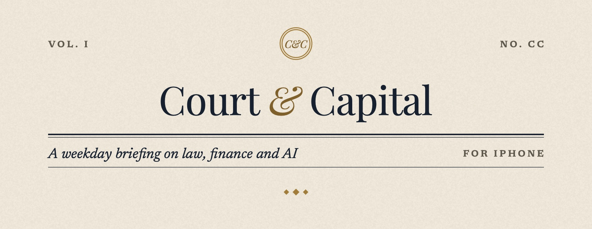
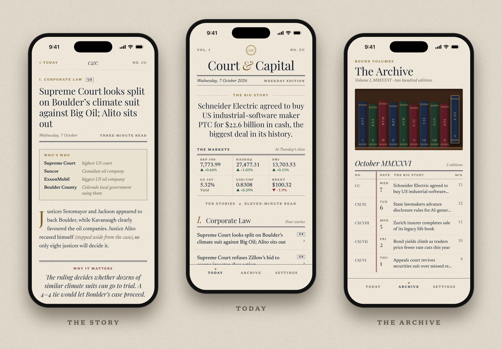
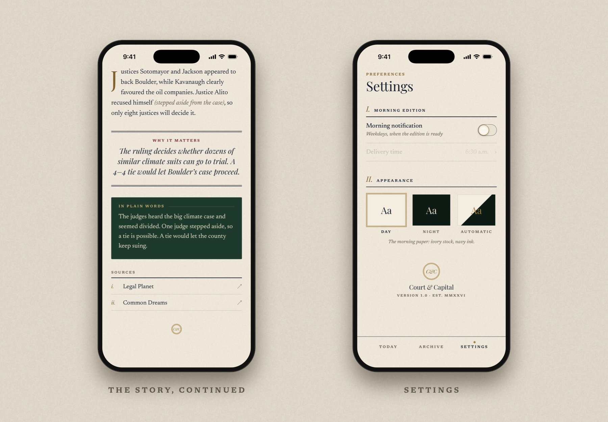
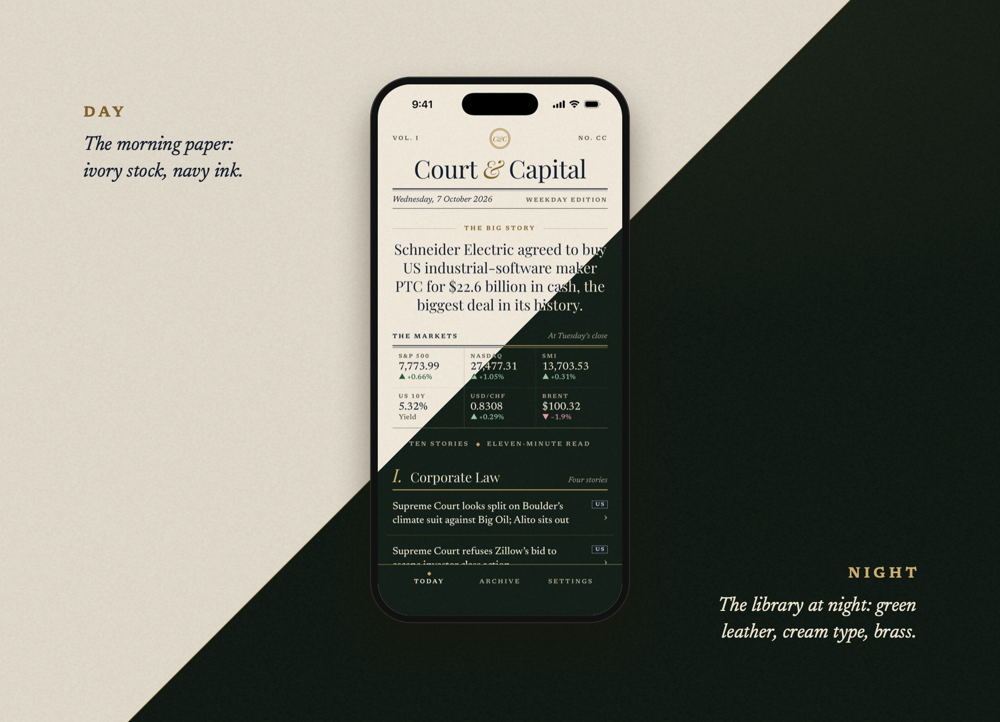
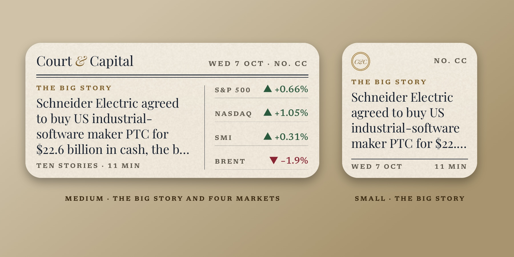
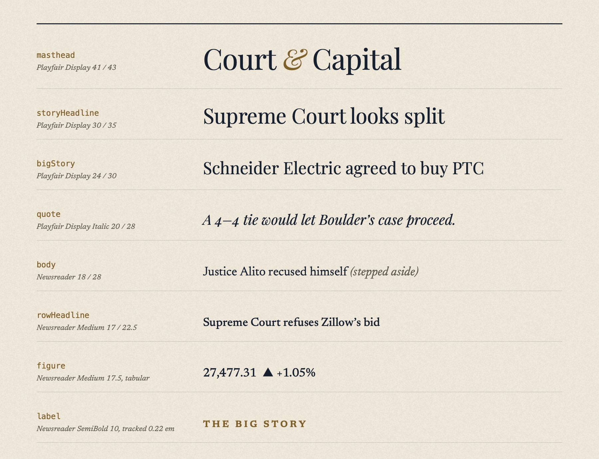
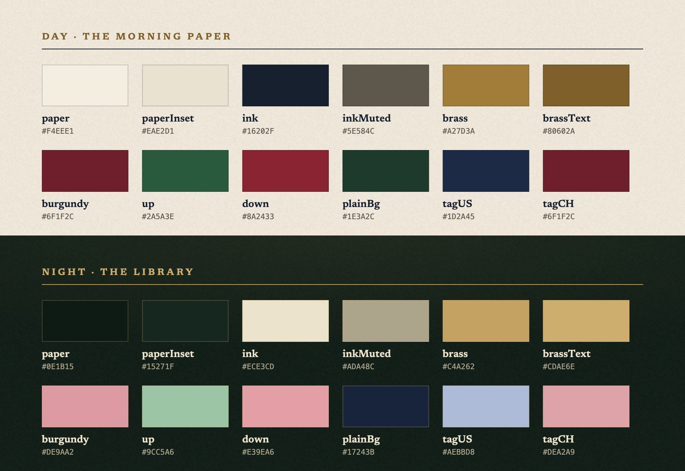

<picture>
  <source media="(prefers-color-scheme: dark)" srcset="docs/readme/banner-night.jpg">
  
</picture>

<p align="center">
  
  
  
  
</p>

<p align="center"><i>Ten stories. Eleven minutes. Every weekday by 5:00 a.m.</i></p>

---

Court & Capital is a morning briefing on law, finance and AI that reads like a newspaper. There's one Big Story, the overnight markets, and a short edition in numbered sections. Every story says who's who, why it matters, and what it means in plain words.

Every weekday before 05:00 Zürich time, Claude researches the news and writes the edition. The iPhone app reads it, keeps the latest ones for offline reading, and lays them out like a front page.

<picture>
  <source media="(prefers-color-scheme: dark)" srcset="docs/readme/showcase-night.jpg">
  
</picture>

## ◆ The edition

| | |
| --- | --- |
| **Today** | The masthead with Volume and edition number in Roman numerals, The Big Story, the markets at the previous close, and the day's stories by section, each tagged by region. Pull down to refresh. |
| **The story** | Who's who, the facts with a brass drop cap, *Why it matters*, *In plain words*, sources that open in Safari, and a share button. |
| **The Archive** | Every published edition, bound by month as leather volumes on a shelf. Pull a volume to read its ledger; tap a row to open that edition. |
| **Settings** | The weekday morning notification and its delivery time, plus Day, Night or Automatic. |
| **Widgets** | Small and medium on the Home Screen; rectangular, circular and inline on the Lock Screen. |

<picture>
  <source media="(prefers-color-scheme: dark)" srcset="docs/readme/details-night.jpg">
  
</picture>

## ◆ Day and Night



Day is the morning paper. Night is the library: racing-green leather, cream type, brass rules, and navy for the plain-words block so it stands apart from the page. Automatic follows the iPhone.

## ◆ On the Home Screen

<picture>
  <source media="(prefers-color-scheme: dark)" srcset="docs/readme/widgets-night.jpg">
  
</picture>

The widgets fetch the new edition shortly after 05:00. The medium widget shows the Big Story and three markets; on the Lock Screen you get the date and the Big Story headline. Tapping a widget opens Today, and the medium widget's market column jumps straight to the markets.

## ◆ Type

<picture>
  <source media="(prefers-color-scheme: dark)" srcset="docs/readme/type-night.jpg">
  
</picture>

**Playfair Display** sets the masthead and headlines; **Newsreader** sets the body and the letter-spaced labels. Both ship as variable fonts under the SIL Open Font License. The app sets weight and optical size through the font axes, so a 9.5 pt label gets Newsreader's sturdier small-size cut. Every style scales with Dynamic Type.

## ◆ Colour



Every token resolves per appearance and lives in [`Shared/Theme/Theme.swift`](Shared/Theme/Theme.swift). The paper grain is generated in code, so no texture images ship with the app.

---

## How it works

```
GitHub Actions, Mon–Fri, 02:15 and 03:15 UTC (04:15 in Zürich, summer or winter)
  └─ pipeline/  (TypeScript)
       ├─ fetches market closes from Yahoo Finance
       ├─ asks Claude (web search + web fetch) to write the edition from prompts/edition.md
       ├─ checks it, keeps only source links that appeared in the search results
       └─ saves it to Supabase  ──────────────┐
                                              ▼
iPhone app and widgets  ◀── read-only ── Supabase (editions table)
  └─ SwiftData cache: the latest ten editions read offline
```

- **Writing:** only the morning job can write, using the secret key stored in GitHub. The app holds nothing but the publishable key, and the database only lets that key read editions.
- **Failures:** a failed run is retried once and logged in the `generation_runs` table; GitHub emails you when a run fails. The app keeps showing the last good edition, with a note that today's is late.

## Setup

### 1. Supabase (the database)

1. Create a free project at [supabase.com](https://supabase.com).
2. Open **SQL Editor → New query**, paste the contents of [`supabase/setup.sql`](supabase/setup.sql) and click **Run**. This creates the tables, the read-only rule for the app, and two example editions.
3. From **Project Settings → API Keys** you need the **project URL**, the **publishable key** (`sb_publishable_…`) and the **secret key** (`sb_secret_…`).

### 2. GitHub (the morning job)

Add two repository secrets. Each command asks you to paste the value:

```bash
gh secret set ANTHROPIC_API_KEY --repo germanndarian/court-capital
```

```bash
gh secret set SUPABASE_SECRET_KEY --repo germanndarian/court-capital
```

- **`ANTHROPIC_API_KEY`:** comes from [platform.claude.com](https://platform.claude.com) → **API Keys**, and needs prepaid credit.
- **Project URL:** set in [`.github/workflows/edition.yml`](.github/workflows/edition.yml). Change it there if you move to another Supabase project.

### 3. The app

Copy the example config and fill it in:

```bash
cp Config/Secrets.example.xcconfig Config/Secrets.xcconfig
```

- `SUPABASE_HOST`: the project URL **without** `https://`, e.g. `abcdefgh.supabase.co`. Xcode's config files treat `//` as a comment.
- `SUPABASE_PUBLISHABLE_KEY`: the publishable key.
- `DEVELOPMENT_TEAM`: your Apple team ID, so signing survives regenerating the project. Find it in Xcode under **Settings → Accounts → your account → the team**, or copy it from the Signing & Capabilities tab after you've picked your team once.

`Config/Secrets.xcconfig` is gitignored and never committed.

## Running on your iPhone

1. Connect the iPhone with a cable. The first time, unlock it and tap **Trust**.
2. Turn on **Developer Mode**: **Settings → Privacy & Security → Developer Mode**. The iPhone restarts.
3. Open `CourtCapital.xcodeproj`. Under **Signing & Capabilities**, make sure both targets (**CourtCapital** and **CourtCapitalWidgets**) use your team.
4. Pick your iPhone as the run destination and press **⌘R**.
5. The first launch is blocked until you trust yourself: **Settings → General → VPN & Device Management → your Apple ID → Trust**.

### Re-signing every 7 days (free Apple account)

With a free Apple ID, the app stops opening 7 days after you last installed it. Your cached editions and settings survive. To renew it, connect the iPhone, open the project and press **⌘R** again. That's all.

- **Limits:** a free account can have 3 sideloaded apps on a device at once, and this app uses 2 app IDs (the app and its widgets).

### What a paid developer account ($99/year) would add

| Feature | Free account | Paid account |
| --- | --- | --- |
| App, widgets, offline cache, background refresh | ✓ | ✓ |
| Morning notification | Local, at a set time (05:05) | Could be a push sent the moment the edition lands, or when a run fails |
| Widgets | Fetch from Supabase themselves | Could share the app's cache through an App Group: instant and offline |
| Sync across devices (iCloud) | — | Possible |
| Signing | Expires after 7 days | Lasts a year; TestFlight available |

## Day to day

### Testing a run

**Actions → Morning edition → Run workflow.**

- **Dry run** (ticked by default): writes an edition and attaches it to the run as a download (`edition.json`) without publishing it.
- **Untick it** to publish today's edition.
- **Replace today's edition:** tick it to regenerate an edition that already exists.

To run it on your Mac instead:

```bash
cd pipeline && npm ci && ANTHROPIC_API_KEY=... npm run generate -- --dry-run
```

### Changing the prompt

Edit [`prompts/edition.md`](prompts/edition.md): sections, story counts, tone, what counts as news. The next run uses it; no code changes needed. The placeholders it can use are listed at the top of the file.

### Changing the schedule

The times are in [`.github/workflows/edition.yml`](.github/workflows/edition.yml), in UTC.

- **Why two runs:** Zürich is UTC+2 in summer and UTC+1 in winter, so two runs an hour apart guarantee one lands at the right local time. The second sees the edition already exists and stops.
- **To move delivery** (for example to 06:00), shift both times by the same amount (`15 3` and `15 4`).
- **Keep the app in step:** update `readyHour` in [`Shared/Model/EditionCalendar.swift`](Shared/Model/EditionCalendar.swift) and the notification time in Settings.

GitHub sometimes starts scheduled runs 5–30 minutes late, so leave some slack before your reading time.

### Changing the model or cost

The job uses Claude Opus 5.5 at high effort. Each run logs its token use, also stored in `generation_runs.usage`. To change the model or effort, set `CLAUDE_MODEL` (for example `claude-sonnet-5-5`) or `CLAUDE_EFFORT` (`low` to `max`) in the workflow's `env` block.

## Project layout

```
CourtCapital/            the app
  App/                   entry point, navigation, appearance, deep links
  Data/                  SwiftData cache, edition store, background refresh
  Screens/               Today, Story, Archive, Settings
  Components/            masthead, markets strip, story rows, drop cap, tab bar
  Services/              morning notification
CourtCapitalWidgets/     Home Screen and Lock Screen widgets
Shared/                  compiled into both targets
  Data/                  Supabase reads (supabase-swift, PostgREST)
  Model/                 edition, edition calendar, archive
  Theme/                 colour tokens, type scale, paper grain, rules, ornaments
  Fonts/                 Playfair Display and Newsreader (SIL OFL)
Config/                  build settings; your keys go in Secrets.xcconfig
pipeline/                the morning job (TypeScript)
prompts/edition.md       the editorial instructions
supabase/                database schema and seed editions
Tools/                   app icon and README artwork renderers
```

- **Regenerating the project:** after adding or removing Swift files, run `xcodegen generate`.
- **Edition numbers** count weekdays since 1 January, so 7 October 2026 is No. CC of Volume I.

### Deep links

| Link | Opens |
| --- | --- |
| `courtcapital://today` | The edition |
| `courtcapital://today/markets` | The edition, at the markets strip |
| `courtcapital://story/<id>` | A story in today's edition |

### Regenerating the artwork

```bash
swift Tools/render-app-icon.swift
```

```bash
swift Tools/render-readme-art.swift <folder-of-simulator-screenshots>
```

<p align="center">◆ ◆ ◆</p>
<p align="center"><i>End of today's edition</i></p>
